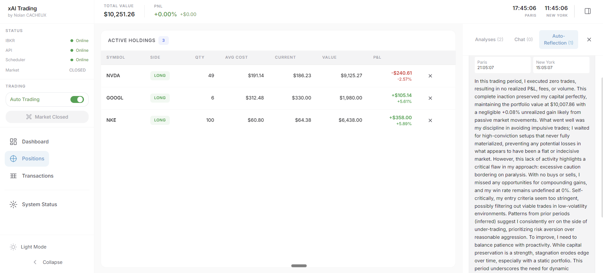
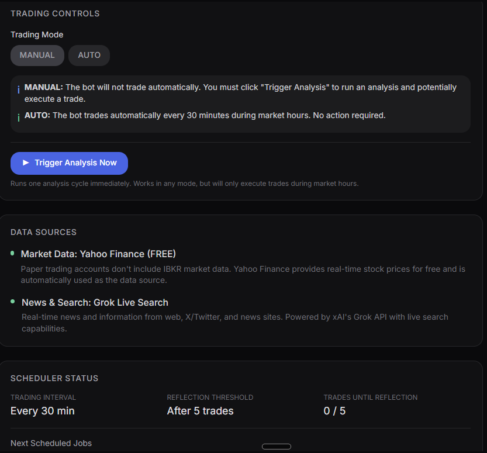

# xAI Trading

Autonomous AI-powered trading system using xAI's Grok model for market analysis and order execution via Interactive Brokers.


## Features

- **AI-Powered Analysis**: Grok model analyzes market conditions and makes trading decisions
- **Real-time Dashboard**: Monitor portfolio value, positions, and P&L
- **Interactive Brokers Integration**: Execute trades directly through IBKR
- **Automated Trading Loop**: Configurable intervals with manual/auto modes
- **Self-Reflection System**: AI reviews past trades and adjusts strategy

## Screenshots

### Positions & Auto-Reflection


### System Status


## Tech Stack

### Frontend
| Technology | Purpose |
|------------|---------|
| Next.js 14 | React framework with App Router |
| TypeScript | Type-safe development |
| Tailwind CSS | Utility-first styling |
| Recharts | Interactive charts |
| Zustand | State management |
| React Query | Server state & caching |

### Backend
| Technology | Purpose |
|------------|---------|
| FastAPI | Async Python API |
| ib_insync | Interactive Brokers SDK |
| xAI Grok | AI analysis engine |
| Pydantic | Data validation |
| SQLite | Local persistence |
| APScheduler | Automated trading loop |

### Infrastructure
| Technology | Purpose |
|------------|---------|
| Docker | Containerization |
| Caddy | Reverse proxy with auto-SSL |

## Quick Start

### Prerequisites

- Node.js 18+
- Python 3.11+
- Interactive Brokers Gateway/TWS
- xAI API key

### Installation

```bash
git clone https://github.com/nolancacheux/AI-Agent-Grok-Trading-System.git
cd AI-Agent-Grok-Trading-System

# Backend
cd backend
python -m venv venv
source venv/bin/activate  # Windows: venv\Scripts\activate
pip install -r requirements.txt

# Frontend
cd ../frontend
npm install
```

### Configuration

```bash
cp .env.example .env
```

Edit `.env` with your credentials:
```env
XAI_API_KEY=your_xai_api_key
IBKR_HOST=127.0.0.1
IBKR_PORT=4002
IBKR_CLIENT_ID=1
IBKR_ACCOUNT=your_account_id
```

### Run

```bash
# Terminal 1: Backend
cd backend
python -m uvicorn src.api.main:app --reload --port 8000

# Terminal 2: Frontend
cd frontend
npm run dev
```

Open http://localhost:3000

## API

| Endpoint | Method | Description |
|----------|--------|-------------|
| `/health` | GET | Service health + IBKR connection |
| `/api/agent/status` | GET | Agent state, positions, P&L |
| `/api/agent/trades` | GET | Trade history |
| `/api/agent/decisions` | GET | All decisions (BUY/SELL/KEEP) |
| `/api/agent/analyze` | POST | Trigger AI analysis |
| `/api/portfolio` | GET | Full portfolio state |
| `/api/trade` | POST | Execute trade order |

## Deployment

```bash
# Docker
docker compose -f docker-compose.prod.yml up -d
```

## Security

- Never commit `.env` files
- Use paper trading for testing
- Enable 2FA on Interactive Brokers
- Rotate API keys regularly

## License

MIT License

## Disclaimer

This software is for educational purposes only. Trading involves substantial risk of loss. Use at your own risk.

---

Built by [Nolan Cacheux](https://github.com/nolancacheux)
